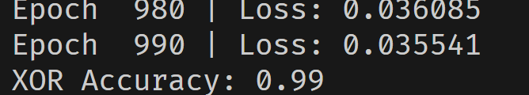
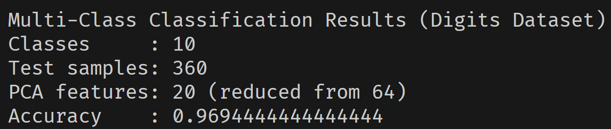
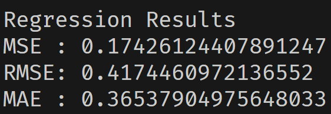
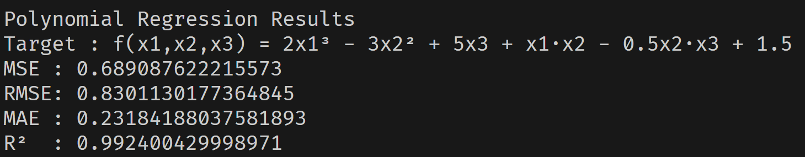

## KAN From Scratch

KAN stands for Kolmogorov-Arnold Network. It is a type of neural network that uses Kolmogorov-Arnold representation to approximate functions. Made it without using PyTorch or TensorFlow.

To understand KANs, you can read about them here:
[Kolmogorov-Arnold Networks: Mathematical Foundations](https://www.s-tronomic.in/post/118)
[Kolmogorov-Arnold Networks: Practical Implementation and MLP comparison](https://www.s-tronomic.in/post/119)

### Installation

(Scikit-learn is not required if oyu are not planning to run TestMultiClassification.py. Only using it to get multi class dataset)

```bash
pip install -r requirements.txt
```

### Model Performance
<!-- Images in results folder -->
XOR:


Multi-class Classification:


Regression:


Polynomial:


### Updates
- Updated code for Adam optimizer and better performance (earlier using SGD)
- Added multi-class classification test
- Performance much better than earlier

